# GitHub API

## Authorization

The github API provides several possible authentication options.

1) **OAuth Authorizing**.

2) **Basic Authentication**.
   

To implement `OAuth` authorization, you need to interact with the server via the `WKWebView`element.
The `OAuth` authorization approach is more secure for the user, since the developers of the physical application cannot access the input data.
Also for this approach you need to create your own app in your dashboard using this link
[https://github.com/settings/developers](https://github.com/settings/developers) in section `OAuth Apps`.   


The `Basic Authentication` workflow allows you to provide the user with their own `UITextField` fields to enter, followed by the string `username:password` you need to encrypt it using the `base64 ` method.

Next, the resulting `access_token` or encrypted username and password should be attached to the headers of each network request.

Note that if you are using `Basic`, you must explicitly specify this in the encrypted password string.

```objectivec
NSString* basicAuthValue = [NSString stringWithFormat:@"Basic jkas3j3iJ8jDhfs42fswRg2g1"];
```

Also, if you use `access_token` from `OAuth`, you should warn about this.

```objectivec
NSString* authValue = [NSString stringWithFormat:@"token DETHLXRYWC254TXLI74ECS6VKMGU"];
```

### Basic authentication implementation

[Copy code](Documentation/text-snippetsbasicAuthentication.txt)

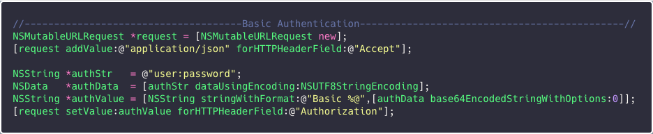

## 

## ## Get a list of folder contents

Note that if the server usually always returns data in dictionary format, the GitHub API often returns an array, as in this case.

[Copy code](Documentation/text-snippets/contentsOfFolder.txt)

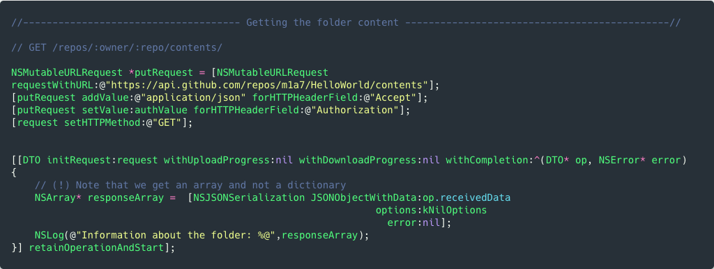

## File creation

Files are created by a `PUT` request.
The file name and extension you specify in the `URL` string, in this example it is `book.txt`.


The contents of the future file must be encrypted in a string using the `base64` method.
Then insert the content into the dictionary of parameters using the `content ` key.

```objectivec
NSDictionary* params = @{ @"message" : @"here enter name of this commit",
                          @"content" : base64Encoded};
```

[Copy code](Documentation/text-snippets/creatingFile.txt)

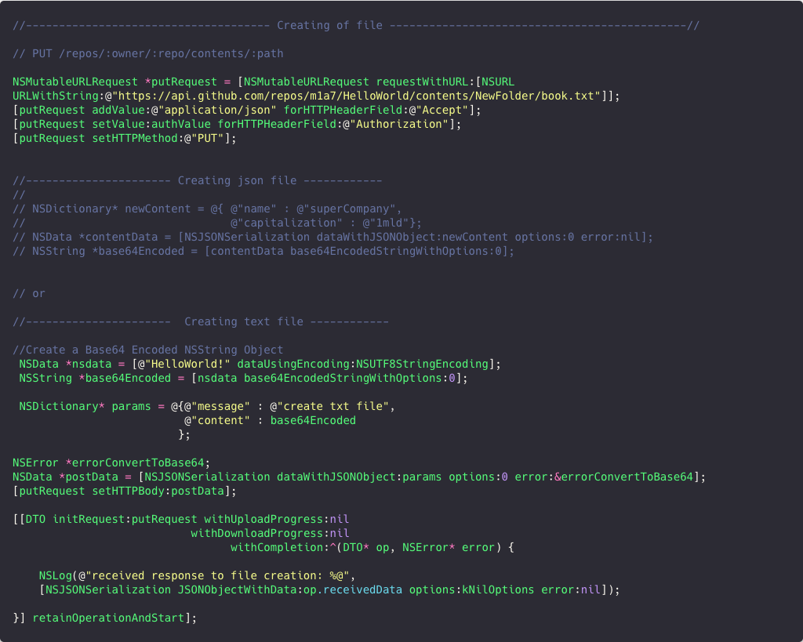

### Uploading an image to the repository folder

 [Copy code](Documentation/text-snippets/uploadImage.txt)

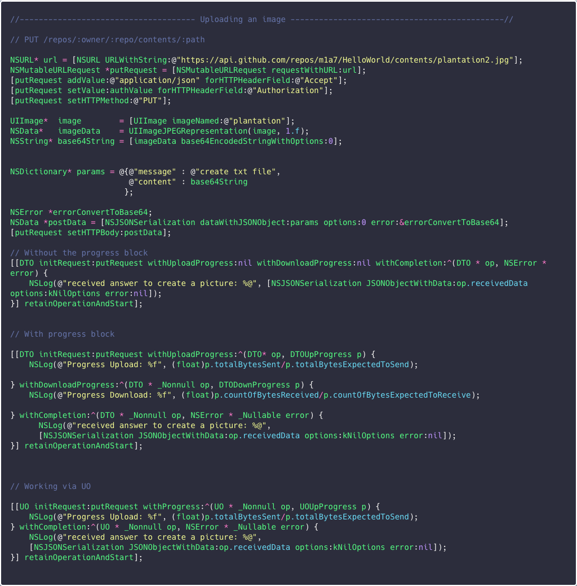

### Create folder

The API's special feature is that you can't just create a folder, for a folder to be created on the server, it must store at least one file.
Therefore, to create a folder, you must upload at least one file to it.
[Copy code](Documentation/text-snippets/creatingFolder.png)

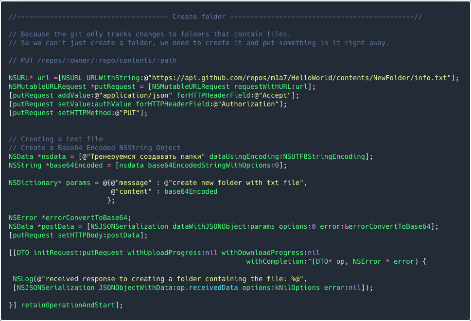

### Delete file

To delete a file from the repository, you need to know its `sha` value. In order to find out the `sha` value, you must make a network request to get a dictionary with information about the file where the `sha`will be located.

[Copy code](Documentation/text-snippets/deletingFile.txt)

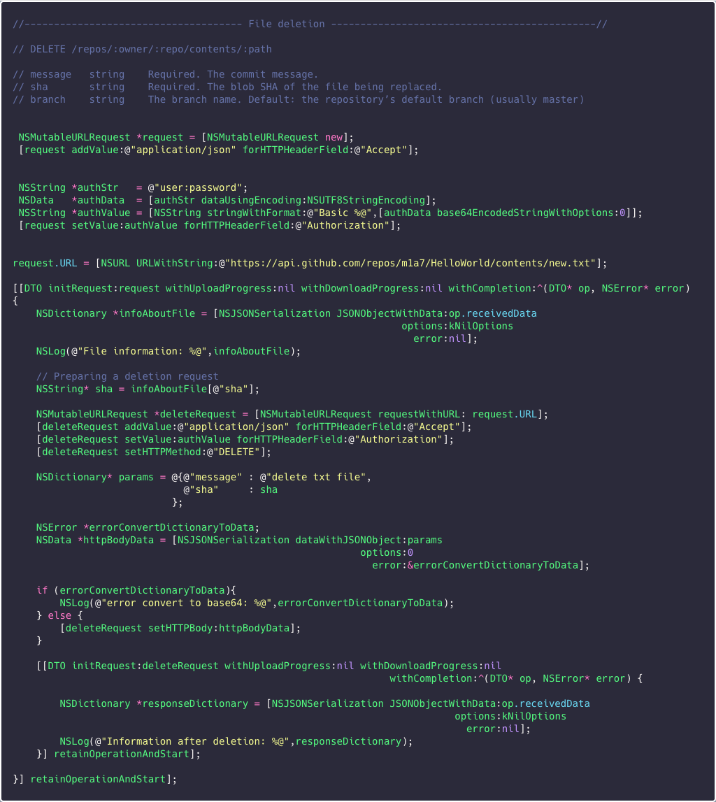

### 

### Updating the file content

In order to update any existing file on the repository, you need to know the `sha` value of this file.
In order to find out the `sha` value, you must make a network request to get a dictionary with information about the file where the `sha`will be located.

[Copy code](Documentation/text-snippets/FileUpdate.txt)

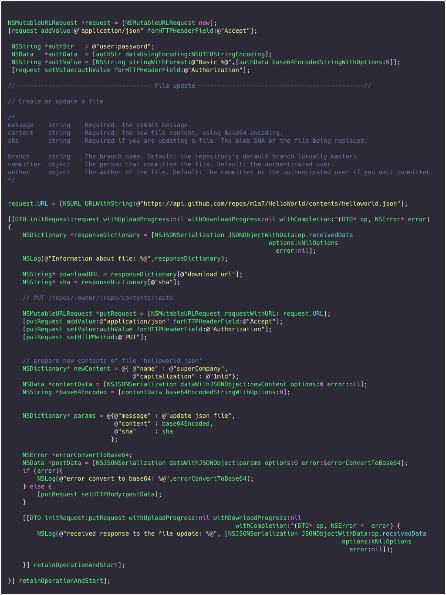

### 

### Getting information about a file

[Copy code](Documentation/text-snippets/gettingInformationAboutFile.txt)

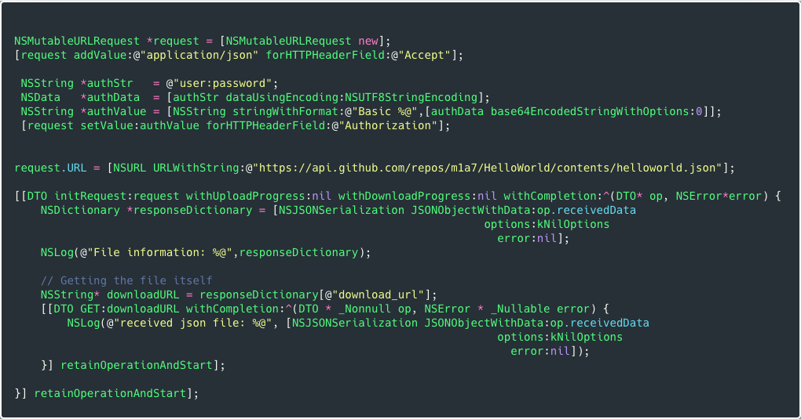


### Getting a list of repositories using (RXNetworkOperation)

[Copy code](Documentation/text-snippets/gettingListOfRepositories-RXNetworkOperation.txt)

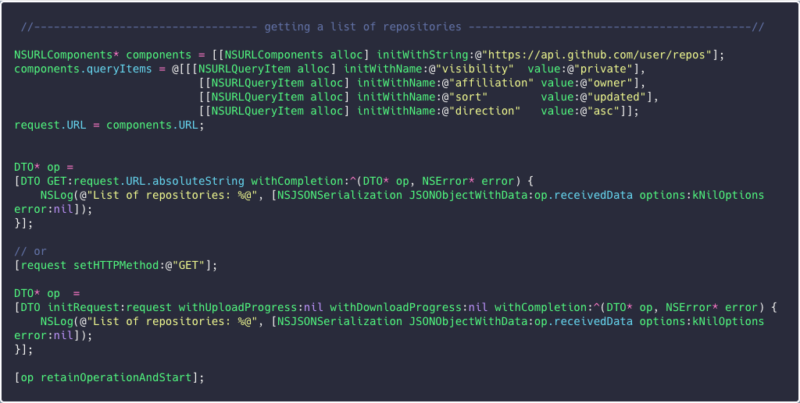

### 

### Getting a list of repositories using (NSURLSession)

Since all the examples of interaction with the server were performed using the `RXNetworkOperation` framework.
For demonstration purposes, a snippet was created on how to achieve the same result using the `NSURLSession` technology.

[Copy code](Documentation/text-snippets/gettingListOFRepositories.txt)

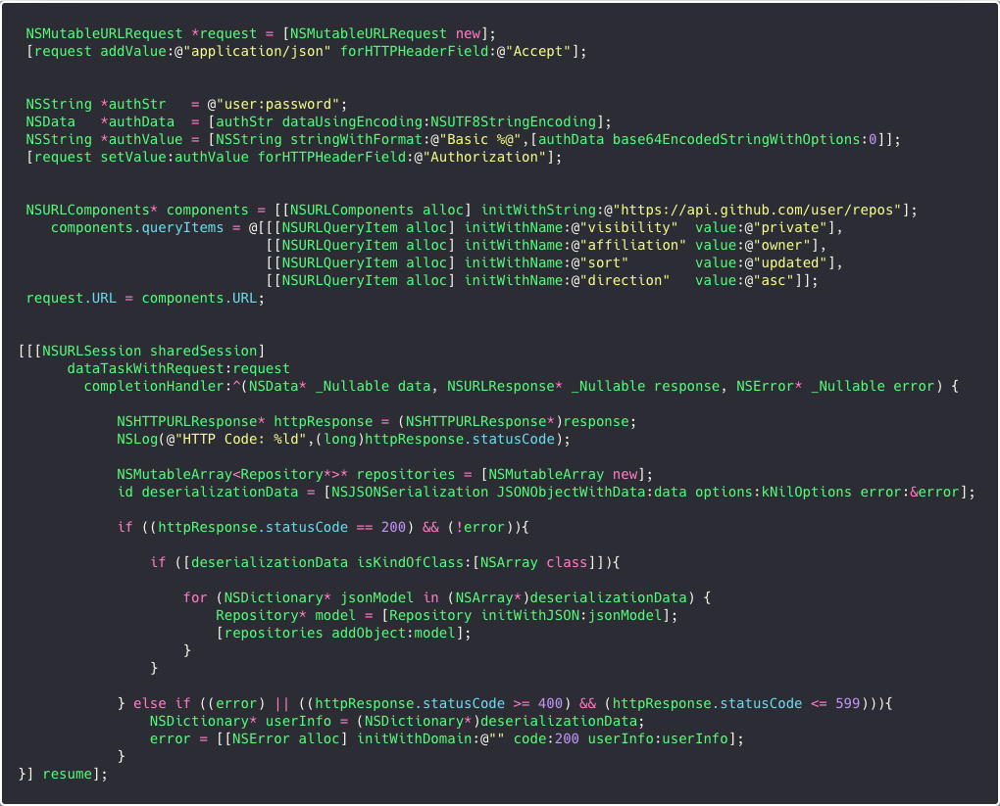


## Useful links

[GitHub API v3 | GitHub Developer Guide](https://developer.github.com/v3/)

[Authorizing OAuth Apps | GitHub Developer Guide](https://developer.github.com/apps/building-oauth-apps/authorizing-oauth-apps/)

[Other Authentication Methods | GitHub Developer Guide](https://developer.github.com/v3/auth/)


## Recommendations

When developing client-server applications, it is important to effectively track all outgoing requests from devices.
App [Bagel](https://github.com/yagiz/Bagel) is a simple network debugger that intercepts all requests from the device.

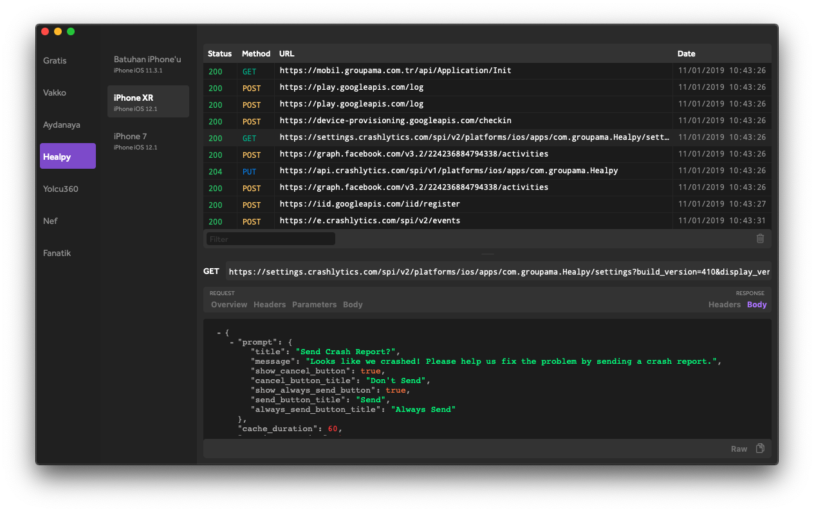

## Additionally

[🇷🇺 Russian Readme](README(RU).md)
